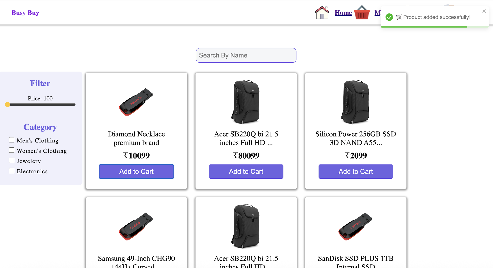
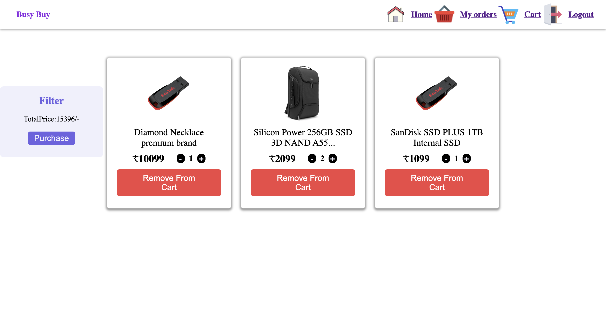
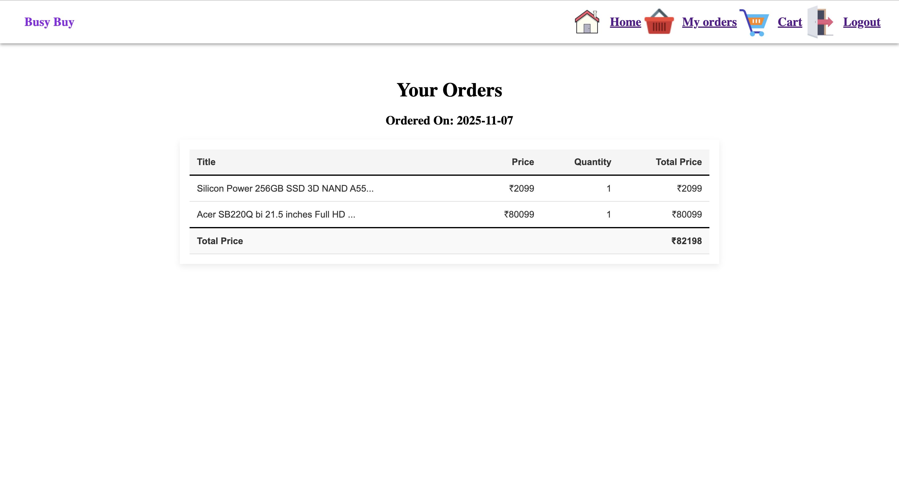
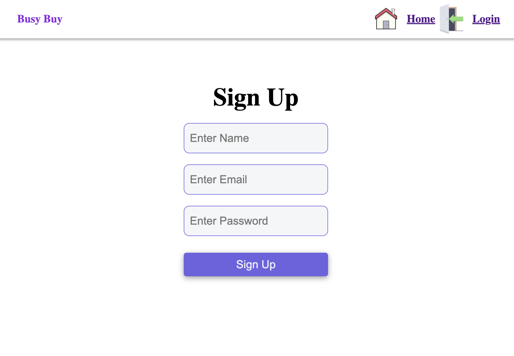
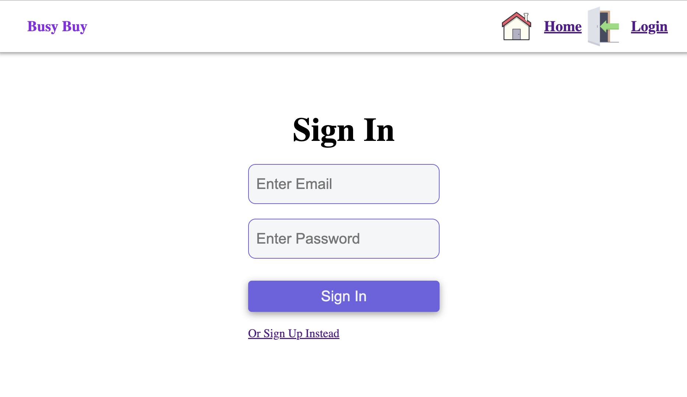

# 🛍️ BuyBusy — Online Shopping Web App (React + Firebase + Context API + React-Router)

> **BuyBusy** is a modern **e-commerce web application** built using **ReactJS**, powered by **Google Firebase Firestore** as its real-time backend.  
> It allows users to **browse products**, **filter by price and category**, **add to cart**, **place orders**, and **manage authentication** — all within a fast, seamless experience.

---

## 🪩 Project Overview

**BuyBusy** is a lightweight yet powerful online shopping platform designed for speed, scalability, and simplicity.  
The project integrates **React with Vite** for blazing-fast builds, while **Firebase** handles **database** and **authentication**.

Key Highlights:

- Real-time product updates from **Google Cloud Firestore**
- User authentication using **Firebase Auth**
- Dynamic routing powered by **React Router v7**
- Global state management with **React Context API**

---

## ✨ Features

### 🧾 Authentication System

- Secure **Sign Up** and **Login** via Firebase Authentication.
- **Session persistence** and **Logout** functionality for user safety.

### 🛒 Product Management

- Fetches all products directly from **Firestore**.
- Products can be **searched** and **filtered** by:
  - Category
  - Price range

### 🛍️ Cart & Orders

- Add products to the cart with quantity tracking.
- Cart data is persisted in Firestore for each user.
- Order management system for tracking user purchases.

### 🧭 Navigation & Routing

- Multi-page routing via **React Router v7**:
  - `/` → HomePage
  - `/cart` → CartPage
  - `/myorders/:userId` → OrdersPage
  - `/signin` → LoginPage
  - `/signup` → RegisterPage

### ⚙️ Context API for Global State

- Application-level state is managed via **React Context API** — ensuring global accessibility of product data, filters, and UI state without prop drilling.

---

## 🧠 Context API Implementation

- BuyBusy leverages the **Context API** to manage app-wide state in a clean, centralized way:

```javascript
// src/context/productContext.jsx
import { createContext, useEffect, useState } from "react";
import { db } from "../configDB/firebase";
import { getDocs, collection } from "firebase/firestore";

export const ProductContext = createContext();

export const ProductContextProvider = ({ children }) => {
  const [products, setProducts] = useState([]);
  const [filteredProducts, setFilteredProducts] = useState([]);
  const [searchTerm, setSearchTerm] = useState("");

  useEffect(() => {
    const fetchProducts = async () => {
      const querySnapshot = await getDocs(collection(db, "products"));
      const data = querySnapshot.docs.map((doc) => ({
        ...doc.data(),
        id: doc.id,
      }));
      setProducts(data);
    };
    fetchProducts();
  }, []);

  const contextValue = {
    products,
    filteredProducts,
    setFilteredProducts,
    searchTerm,
    setSearchTerm,
  };

  return (
    <ProductContext.Provider value={contextValue}>
      {children}
    </ProductContext.Provider>
  );
};
```

---

- This context is then wrapped around the entire app in main.jsx:

```javascript
import { ProductContextProvider } from "./context/productContext.jsx";

createRoot(document.getElementById("root")).render(
  <ProductContextProvider>
    <App />
  </ProductContextProvider>
);
```

---

## 🧱 Folder Structure

```
MINI-PROJECT-BUYBUSY-I/
│
├── public/
│ └── vite.svg
│
├── src/
│ ├── configDB/
│ │ └── firebase.js # Firebase configuration
│ ├── context/
│ │ ├── authContext.js # Authentication context
│ │ └── productContext.jsx # Global product state management
│ ├── components/
│ │ ├── Navbar/ # Navigation bar
│ │ ├── Product/ # Product cards, lists
│ │ ├── FilterSidebar/ # Category/price filtering
│ │ └── OrderTable/ # User orders table
│ ├── pages/
│ │ ├── HomePage/
│ │ ├── CartPage/
│ │ ├── LoginPage/
│ │ ├── RegisterPage/
│ │ ├── OrdersPage/
│ │ └── NotFoundPage/
│ ├── App.jsx # Main React component
│ ├── main.jsx # Entry file with context provider
│ ├── data.js
│ ├── index.css
│ └── App.css
│
├── package.json
├── vite.config.js
└── README.md
```

---

## ⚙️ Tech Stack

| Technology                  | Purpose                                     |
| --------------------------- | ------------------------------------------- |
| **ReactJS (with Vite)**     | Component-based frontend, fast build system |
| **Firebase Firestore**      | Real-time NoSQL database                    |
| **Firebase Authentication** | Secure login and registration               |
| **React Router v7**         | Client-side routing                         |
| **React Context API**       | Application-wide state management           |
| **React Toastify**          | Notifications and alerts                    |
| **CSS Modules**             | Scoped component styling                    |

---

## 🧭 User Flow

- Sign Up / Login — Authenticate using Firebase.
- View Products — Browse and filter products dynamically.
- Add to Cart — Add or remove products; data synced with Firestore.
- Checkout & Orders — Review orders placed and view order history.
- Logout — Securely sign out of the application.

---

## 🖼️ Screenshots

🏠 Home Page :


🛒 Cart Page :


📦 Orders & Deliveries :


🔐 SignUp/Login :



---

## 🚀 Getting Started

### Clone the Repository

```bash
git clone https://github.com/kanishk-469/BuyBusy-Online-Shopping-Web-App-React-Firebase-Context-API-React-Router.git
```

### 🧩 Configure Firebase

- To connect Firebase:
- Go to Firebase Console
- Create a new project.
- Enable Firestore Database and Authentication (Email/Password).
- Replace your Firebase credentials in: src/configDB/firebase.js

```bash
const firebaseConfig = {
apiKey: "YOUR_API_KEY",
authDomain: "YOUR_APP.firebaseapp.com",
projectId: "YOUR_PROJECT_ID",
storageBucket: "YOUR_APP.appspot.com",
messagingSenderId: "YOUR_SENDER_ID",
appId: "YOUR_APP_ID",
};

```

### Install Dependencies

```bash
npm install
```

### Start the App

```bash
npm start
```

Your app will run at 👉 **http://localhost:5173**

---

## 🎯 Future Enhancements

- Add payment gateway integration (Stripe/PayPal/rayzor pay)
- Wishlist and product recommendations
- Pagination and product sorting
- Role-based admin dashboard for managing products

---

## 👨‍💻 Author

**Kanishka Singh**  
 Full-Stack Web Developer | React Enthusiast | UI Recreator | Backend API creator
🌐 [GitHub](https://github.com/kanishk-469)  
💼 [LinkedIn](https://www.linkedin.com/in/kanishka-singh-14291157/)

---

> 🛒 _“Shop smarter, faster, and simpler — powered by React, Firebase, and Context API.”_
